  

<h1 align="center">Ujjwal Sharma</h1>
<h3 align="center">AI Engineer & Full-Stack Developer</h3>

  <em>RAG Systems · FastAPI · Next.js · Production GenAI Tools</em>

  
  
  

---

I build and ship practical AI and full-stack systems that solve real business problems.

There's a gap between code that works in a demo and code that actual people depend on. Most projects never close that gap — mine do. Migrating a live CO₂ calculator from Vanilla JS to Next.js 15 while clients were actively using it, and delivering 7,984 verified company records via a Python pipeline to a sales team, taught me what "useful" really means.

**Open to:** Remote-first roles globally · On-site in Bangalore, Gurugram, Mumbai, or Hyderabad

---

## What I've Shipped

### Travel CO₂ Calculator — Treesy.dk

Built a production carbon-footprint calculator for a Denmark-based climate-tech startup. Started in Vanilla JavaScript, then migrated the entire tool to **Next.js 15 App Router** while it was live and being used by real business clients. Includes a 4-source geocoding fallback (IATA airport codes → Nominatim → Photon → Google Maps Places API) to handle edge cases that single-source geocoding couldn't cover.

**Stack:** Next.js 15 · Python · FastAPI · Tailwind CSS · Google Maps API · REST APIs · Data Engineering

---

### B2B Lead Pipeline

Built a 3-script Python data pipeline for Danish company research. Used the Virk CVR Elasticsearch API for bulk extraction, proff.dk for contact enrichment, and cvrapi.dk for deduplication and field normalization. Delivered **7,984 verified Danish company records** as a clean CSV to the sales team — replacing weeks of manual research.

**Stack:** Python · Web Scraping · REST APIs · Data Engineering

---

### Certificate Generation System

Built an automated HTML certificate generation system supporting 4 tiers: Active, Committed, Hero, and Legend Planter. Uses variable injection templates (`{{NAME}}`, `{{DATE}}`, `{{CERT_NUMBER}}`) wired into FastAPI and Supabase for real-time issuance.

**Stack:** FastAPI · Supabase · Python · HTML Templates

---

### DocuMind — RAG Document Assistant

Built a Retrieval-Augmented Generation document assistant designed to reduce unsupported LLM answers by grounding responses in uploaded documents. Uses vector-based retrieval to provide cited, contextual answers.

**Stack:** FastAPI · LangChain · ChromaDB · Hugging Face · OpenRouter · React

---

### SnapClass — Biometric Attendance System

Built a biometric attendance system combining face recognition (dlib + scikit-learn SVC) and voice recognition (Resemblyzer + librosa) with a Supabase backend and Streamlit frontend.

**Links:** [Landing Page](https://landing-page-smart-class-q221.vercel.app/)

**Stack:** dlib · scikit-learn · Resemblyzer · librosa · Supabase · Streamlit

---

### AdFeed Studio — Ad Preview Generator

Built a product-feed parser and advertising preview tool that generates ad preview cards in Meta, TikTok, and Google Shopping formats. Takes structured product data and reduces manual creative work.

**Stack:** React · Python · REST APIs

---

## Professional Experience

### AI & Data Strategy Intern — [Treesy.dk](https://treesy.dk)

**February 2026 – May 2026** · Remote (India)

Treesy is a Denmark-based climate-tech startup helping businesses measure and offset their carbon footprint through tree planting.

- Built the Travel CO₂ Calculator from scratch and migrated it from Vanilla JS to Next.js 15 while live
- Built a B2B lead-generation pipeline delivering 7,984 verified company records
- Built an automated certificate generation system for 4 tiers with FastAPI/Supabase
- Built a live pricing component with tree counters across 5 DKK tiers
- Implemented a 4-source geocoding fallback for the CO₂ calculator
- Conducted competitor pricing and market research for outbound targeting

### Full-Stack Developer & AI Engineer — Freelance & Academic Projects

**September 2023 – Present** · Bareilly, India

- Built SnapClass (biometric attendance: face + voice recognition)
- Built AdFeed Studio (product feed parser → ad previews for Meta, TikTok, Google Shopping)
- Shipped 5+ MERN applications to production, focused on mobile usability and reliability
- Integrated Oracle OCI services and third-party APIs across multiple platforms

---

## 🛠️ Technology Stack

  

 

#### 🧠 Generative AI, RAG & LLMs

#### 💻 Full-Stack & Frontend

#### ⚙️ Backend, Data & APIs

#### 🗄️ Databases & Cloud Infrastructure

---

## Education

**Bachelor of Computer Applications (BCA) in Artificial Intelligence**  
Invertis University · September 2023 – May 2026

---

## Certifications

- **Oracle Cloud Infrastructure 2025 Certified AI Foundations Associate**
- **Gemini Certified University Student** — Google
- **McKinsey.org Forward Program**
- **Getting Started Building an On-Premise Data Warehouse using SAP BW/4HANA** — Course Completion
- **Introduction to Data Science**

---

## 📊 GitHub Analytics & Activity

  
  &nbsp;
  

    

  

    

  <h3>🐍 Contribution Graph</h3>

  <picture>
    <source media="(prefers-color-scheme: dark)" srcset="https://raw.githubusercontent.com/us8024435-debug/us8024435-debug/output/github-contribution-grid-snake-dark.svg" />
    <source media="(prefers-color-scheme: light)" srcset="https://raw.githubusercontent.com/us8024435-debug/us8024435-debug/output/github-contribution-grid-snake.svg" />
    
  </picture>

---

  <strong>Looking for an AI Engineer or Full-Stack Developer who ships production code?</strong> 
  <a href="mailto:us5533400@gmail.com">us5533400@gmail.com</a> · <a href="https://www.linkedin.com/in/ujjwal-sharma-ai">LinkedIn</a> · <a href="https://ujjwal-sharma-dev.netlify.app/">Portfolio</a>

